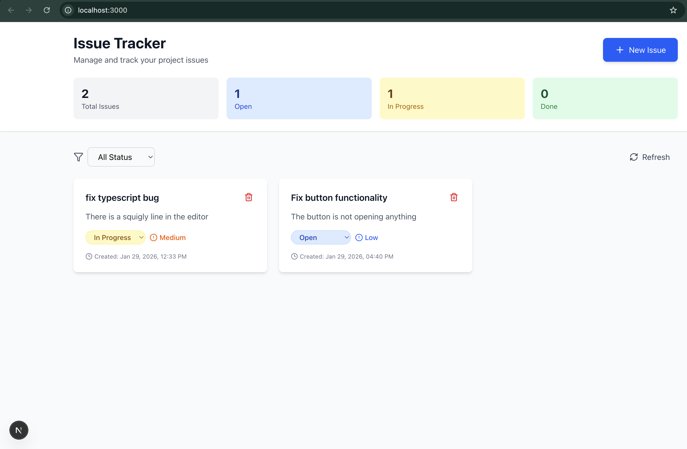

# Serverless Issue Tracker

A full-stack serverless issue tracking application built with AWS Lambda, DynamoDB, and Next.js. This project demonstrates production-ready serverless architecture with pragmatic design choices and clear separation of concerns.

## Overview

This application provides a complete issue tracking system with CRUD operations, status filtering, and real-time updates. It's built entirely on serverless technologies, making it scalable, cost-effective, and easy to maintain.



## Architecture

### Backend (Serverless API)
- **Runtime:** .NET 8
- **Infrastructure:** AWS SAM (Serverless Application Model)
- **API:** AWS API Gateway (REST)
- **Compute:** AWS Lambda Functions
- **Database:** Amazon DynamoDB with Global Secondary Index
- **Monitoring:** AWS X-Ray tracing enabled

### Frontend (Next.js)
- **Framework:** Next.js 16 with Pages Router
- **Language:** TypeScript
- **Styling:** Tailwind CSS v4
- **Icons:** Lucide React
- **HTTP Client:** Axios

## Features

- ✅ Create, read, update, and delete issues
- ✅ Filter issues by status (Open, In Progress, Done)
- ✅ Real-time statistics dashboard
- ✅ Priority levels (Low, Medium, High)
- ✅ Responsive design for mobile and desktop
- ✅ Serverless architecture with automatic scaling
- ✅ Pay-per-request pricing model
- ✅ DynamoDB point-in-time recovery enabled

## Project Structure

```
serverless-Issue-tracker/
├── src/                              # Backend source code
│   ├── IssueTracker.Api/            # Lambda handlers and API layer
│   │   ├── Handlers/
│   │   │   ├── CreateIssueHandler.cs
│   │   │   ├── GetIssueHandler.cs
│   │   │   ├── ListIssuesHandler.cs
│   │   │   ├── UpdateIssueHandler.cs
│   │   │   └── DeleteIssueHandler.cs
│   │   └── IssueTracker.Api.csproj
│   ├── IssueTracker.Core/           # Domain models and business logic
│   │   ├── Models/
│   │   ├── Interfaces/
│   │   ├── Services/
│   │   └── Validation/
│   └── IssueTracker.Infrastructure/ # DynamoDB repository layer
├── issue-tracker-frontend/          # Next.js frontend application
│   ├── src/
│   │   ├── components/
│   │   │   ├── IssueCard.tsx
│   │   │   └── CreateIssueForm.tsx
│   │   ├── lib/
│   │   │   └── api.ts
│   │   ├── pages/
│   │   │   ├── _app.tsx
│   │   │   └── index.tsx
│   │   └── styles/
│   │       └── globals.css
│   ├── package.json
│   └── next.config.ts
├── docs/                            # Documentation and assets
│   └── app-screenshot.png
├── template.yaml                    # AWS SAM infrastructure template
├── samconfig.toml                   # SAM deployment configuration
└── README.md                        # This file
```

## Prerequisites

### Backend
- [.NET 8 SDK](https://dotnet.microsoft.com/download/dotnet/8.0)
- [AWS CLI](https://aws.amazon.com/cli/) configured with credentials
- [AWS SAM CLI](https://docs.aws.amazon.com/serverless-application-model/latest/developerguide/install-sam-cli.html)
- An AWS account with appropriate permissions

### Frontend
- [Node.js](https://nodejs.org/) 18.x or later
- npm or yarn package manager

## Getting Started

### 1. Clone the Repository

```bash
git clone <repository-url>
cd serverless-Issue-tracker
```

### 2. Backend Setup & Deployment

#### Install Dependencies
```bash
cd src/IssueTracker.Api
dotnet restore
cd ../..
```

#### Build the Application
```bash
sam build
```

#### Deploy to AWS
```bash
sam deploy --guided
```

During the guided deployment, you'll be prompted to configure:
- Stack name (default: `issue-tracker`)
- AWS Region (choose your preferred region)
- Confirm changes before deploy
- Allow SAM CLI IAM role creation
- Save arguments to configuration file

After deployment completes, note the `ApiUrl` output - you'll need this for the frontend.

#### View Deployed Resources
```bash
sam list stack-outputs --stack-name issue-tracker
```

### 3. Frontend Setup

#### Navigate to Frontend Directory
```bash
cd issue-tracker-frontend
```

#### Install Dependencies
```bash
npm install
```

#### Configure Environment Variables

Create a `.env.local` file in the `issue-tracker-frontend` directory:

```env
NEXT_PUBLIC_API_URL=https://your-api-id.execute-api.region.amazonaws.com/prod/
```

Replace the URL with the `ApiUrl` output from your SAM deployment.

#### Start Development Server
```bash
npm run dev
```

Open [http://localhost:3000](http://localhost:3000) in your browser.

## Development

### Backend Development

#### Run Tests (if configured)
```bash
dotnet test
```

#### Local API Testing with SAM
```bash
sam local start-api
```

#### Invoke a Specific Function Locally
```bash
sam local invoke CreateIssueFunction -e events/create-issue.json
```

### Frontend Development

#### Run Development Server
```bash
cd issue-tracker-frontend
npm run dev
```

#### Build for Production
```bash
npm run build
```

#### Start Production Server
```bash
npm start
```

#### Lint Code
```bash
npm run lint
```

## API Documentation

### Base URL
After deployment, your API will be available at:
```
https://{api-id}.execute-api.{region}.amazonaws.com/prod/
```

The actual URL will be provided in the SAM deployment outputs.

### Endpoints

#### Create Issue
```http
POST /issues
Content-Type: application/json

{
  "title": "Bug in login page",
  "description": "Users cannot log in with special characters in password",
  "priority": "High"
}
```

#### List All Issues
```http
GET /issues
```

Query Parameters:
- `status` (optional): Filter by status (`Open`, `InProgress`, `Done`)

#### Get Single Issue
```http
GET /issues/{id}
```

#### Update Issue
```http
PUT /issues/{id}
Content-Type: application/json

{
  "status": "InProgress",
  "priority": "Medium"
}
```

#### Delete Issue
```http
DELETE /issues/{id}
```

### Response Format

#### Success Response
```json
{
  "success": true,
  "data": {
    "id": "123e4567-e89b-12d3-a456-426614174000",
    "title": "Bug in login page",
    "description": "Users cannot log in with special characters in password",
    "status": "Open",
    "priority": "High",
    "createdAt": "2024-01-29T12:00:00Z"
  }
}
```

#### Error Response
```json
{
  "success": false,
  "error": {
    "message": "Issue not found"
  }
}
```

## Tech Stack Details

### Backend
- **AWS Lambda**: Serverless compute for API handlers
- **API Gateway**: RESTful API with CORS enabled
- **DynamoDB**: NoSQL database with single-table design
- **FluentValidation**: Request validation
- **Microsoft.Extensions.DependencyInjection**: Dependency injection
- **AWS X-Ray**: Distributed tracing

### Frontend
- **Next.js 16**: React framework with server-side rendering
- **TypeScript**: Type-safe JavaScript
- **Tailwind CSS v4**: Utility-first CSS framework
- **Axios**: HTTP client for API requests
- **Lucide React**: Icon library

## DynamoDB Table Design

### Table: IssueTrackerTable
- **Partition Key (PK):** `ISSUE#{id}`
- **Sort Key (SK):** `METADATA`
- **Global Secondary Index (GSI1):**
  - **GSI1PK:** `STATUS#{status}`
  - **GSI1SK:** `CREATED#{timestamp}`

This design enables:
- Efficient single-item retrieval by ID
- Fast status-based queries using GSI
- Chronological sorting within each status

## Deployment

### Update Backend
```bash
sam build && sam deploy
```

### Deploy Frontend

#### Option 1: Vercel (Recommended)
```bash
cd issue-tracker-frontend
npm install -g vercel
vercel
```

#### Option 2: AWS Amplify
1. Connect your Git repository to AWS Amplify
2. Configure build settings:
   - Build command: `npm run build`
   - Output directory: `.next`
3. Add environment variable: `NEXT_PUBLIC_API_URL`

#### Option 3: Docker
```bash
cd issue-tracker-frontend
docker build -t issue-tracker-frontend .
docker run -p 3000:3000 issue-tracker-frontend
```

## Monitoring & Logs

### View Lambda Logs
```bash
sam logs -n CreateIssueFunction --stack-name issue-tracker --tail
```

### CloudWatch Insights
```bash
aws logs tail /aws/lambda/IssueTracker-CreateIssue --follow
```

### X-Ray Traces
View distributed traces in the AWS X-Ray console to analyze performance and debug issues.

## Cost Considerations

This serverless architecture is extremely cost-effective:

- **Lambda**: Free tier includes 1M requests/month
- **API Gateway**: Free tier includes 1M API calls/month
- **DynamoDB**: Pay-per-request with free tier (25 GB storage, 2.5M read/write requests)
- **Typical monthly cost for low-medium traffic:** < $5 USD

## Troubleshooting

### Frontend can't connect to backend
1. Verify `NEXT_PUBLIC_API_URL` in `.env.local` matches your API Gateway URL
2. Check that CORS is enabled in the API Gateway configuration
3. Ensure the backend is deployed and healthy

### Lambda function timeout
1. Check CloudWatch logs for the specific function
2. Increase timeout in `template.yaml` if needed (current: 30s)
3. Review DynamoDB query efficiency

### Styles not loading
1. Ensure you're using Tailwind CSS v4 syntax: `@import "tailwindcss";`
2. Restart the Next.js dev server: `npm run dev`
3. Clear `.next` cache: `rm -rf .next && npm run dev`

## Security Considerations

- API is currently public (CORS set to `*`). For production, restrict CORS origins.
- Consider adding authentication (AWS Cognito, Auth0, etc.)
- Implement rate limiting on API Gateway
- Use AWS WAF for additional protection
- Enable DynamoDB encryption at rest (default)
- Review IAM policies for least privilege access

## Future Enhancements

- [ ] User authentication and authorization
- [ ] Comments on issues
- [ ] File attachments
- [ ] Email notifications
- [ ] Real-time updates with WebSockets
- [ ] Advanced filtering and search
- [ ] Issue assignment to team members
- [ ] Time tracking
- [ ] API rate limiting
- [ ] Automated testing suite

## Contributing

1. Fork the repository
2. Create a feature branch (`git checkout -b feature/amazing-feature`)
3. Commit your changes (`git commit -m 'Add amazing feature'`)
4. Push to the branch (`git push origin feature/amazing-feature`)
5. Open a Pull Request

## License

This project is licensed under the MIT License - see the LICENSE file for details.

## Support

For issues, questions, or contributions, please open an issue in the GitHub repository.

---

**Built with ❤️ using AWS Serverless and Next.js**
